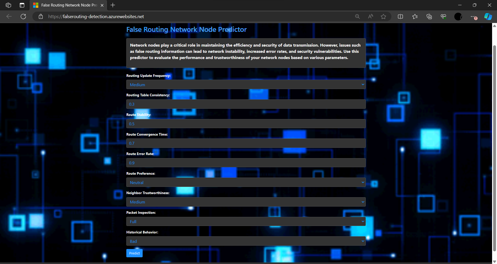

# False_routing_network-node_detection

## DETECTING NETWORK NODES GENERATING FALSE ROUTING INFORMATION

## Web link : https://falserouting-detection.azurewebsites.net/

### AIM
To develop a machine learning-based web application that detects malicious network nodes using gradient boosting, feature selection, and oversampling techniques, integrated with a user-friendly interface for real-time prediction and analysis. 

## Description
In modern computer networks, the presence of malicious nodes can pose significant security threats, leading to data breaches, unauthorized access, and other cyber attacks. Identifying these malicious nodes in real-time is crucial for maintaining network security and integrity. The objective of this project is to create a robust machine learning model that can accurately classify network nodes as either malicious or benign based on various features related to their behavior and characteristics. The model will be trained on a synthetic dataset with both categorical and numerical features, using techniques such as one-hot encoding, scaling, oversampling with SMOTE, and feature selection through gradient boosting. Additionally, a web application will be developed to enable users to input new network node data and receive real-time predictions regarding the node's status. This application will provide an intuitive interface for non-technical users, making it easier to monitor and manage network security.

### Accuracy: 0.7811529933481153

## License
This project is licensed under the MIT License. See the LICENSE file for details.

## Author
Jagdeesh P
